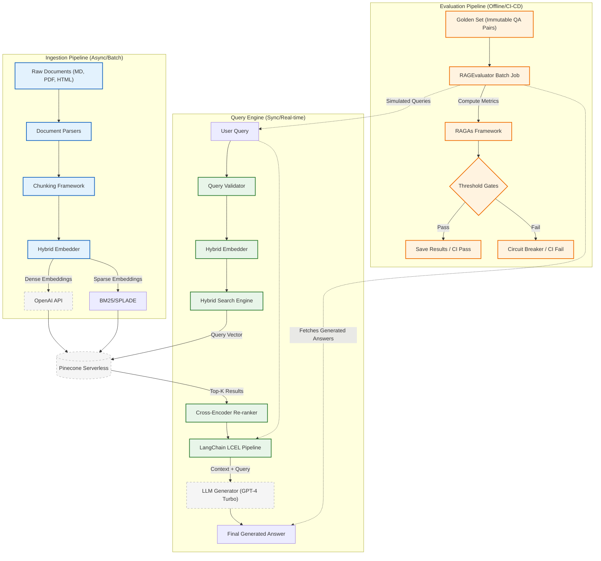

# Context-Aware RAG Agent: Flow & Evaluation Plan

This document details the exact execution flow of the system and the offline validation and evaluation framework implemented using RAGAs.

## 1. System Execution Flow

The system operates across three decoupled services: Ingestion, Retrieval/Query, and Evaluation.

### System Architecture Diagram



### A. Ingestion Flow
1. **Parsing**: Raw files (Markdown, PDF, HTML) in `data/raw/` are parsed using standard loaders.
2. **Chunking**: Based on configuration (`src/ingestion/chunker.py`), text is split using:
   - `RecursiveCharacterTextSplitter` (baseline)
   - `SemanticChunker` (advanced thresholding)
   - `MarkdownHeaderTextSplitter` (structure-aware)
3. **Embedding**: `HybridEmbedder` generates both a dense vector (`text-embedding-3-small`) and a sparse vector (BM25) for each chunk.
4. **Indexing**: Chunks are upserted to a serverless AWS Pinecone index (`src/retrieval/pinecone_client.py`), organized via namespaces for isolation and multi-tenancy.

### B. Retrieval & Query Flow
1. **Validation**: The user's query is sanitized through the `QueryValidator` (`src/query/validator.py`).
2. **Vectorization**: The query is independently embedded (dense + sparse).
3. **Hybrid Search**: `HybridSearchEngine` queries Pinecone. The search relies on a convex combination defined by an $\alpha$ hyperparameter (where $\alpha=1$ is purely dense, $\alpha=0$ is purely sparse).
4. **Re-Ranking**: A cross-encoder model (`ms-marco-MiniLM`) re-scores the Top-K fetched documents to maximize Context Precision.
5. **Generation**: The context is formatted and passed to a LangChain LCEL pipeline (`src/query/engine.py`), invoking `ChatOpenAI` (GPT-4 Turbo).

---

## 2. Evaluation & Validation Framework

The evaluation pipeline is entirely offline, utilizing the `RAGAs` framework to measure specific architectural metrics against a version-controlled "Golden Set" (a static dataset of queries and ground truth answers).

### Core RAGAs Metrics & Thresholds
The `RAGEvaluator` (`src/evaluation/ragas_evaluator.py`) executes batch processing against the Golden Set and calculates four critical scores ([0.0, 1.0] range):

1. **Faithfulness (Threshold $\ge 0.70$)**  
   - *Definition*: Measures if the generated answer can be directly inferred from the retrieved context (detects hallucination).
   - *Failure Mode*: LLM relies on parametric memory instead of retrieved data.
2. **Answer Relevancy (Threshold $\ge 0.75$)**  
   - *Definition*: Measures how well the generated answer addresses the actual user query.
   - *Failure Mode*: LLM generates a mathematically correct but functionally unrelated response.
3. **Context Precision (Threshold $\ge 0.80$)**  
   - *Definition*: Measures if all ground-truth relevant items present in the context are ranked higher than irrelevant ones.
   - *Failure Mode*: Hybrid Search parameters ($\alpha$) or Cross-Encoder fails to prioritize exactly what the LLM needs.
4. **Context Recall (Threshold $\ge 0.70$)**  
   - *Definition*: Measures if the retrieved context contains all necessary information to formulate the ground truth answer.
   - *Failure Mode*: Chunk size is too small, or the Top-K retrieval cutoff is too low.

### Regression Detection
The system runs `check_thresholds()` to gate CI/CD pipelines. It also runs `detect_regression()` which loads historical telemetry (baseline JSON files). If any metric drops by $>5\%$ compared to the baseline, the pipeline fails immediately.

---

## 3. Standard Evaluation Run (Step-by-Step)

To validate the system offline, an engineer would perform the following steps:

**Step 1. Prepare Golden Set**  
Populate `data/golden_set.json` with static `(query, ground_truth)` pairs. This dataset is immutable per version.

**Step 2. Alpha Parameter Tuning (Optional but Optimal)**  
Run the `tune_alpha()` function inside `HybridSearchEngine`. The system will execute a grid search (e.g., `alpha_range = [0.0, 0.1, ..., 1.0]`) on the Golden Set to empirically determine the $\alpha$ value that yields the highest Precision@K.

**Step 3. Execute Batch Pipeline**  
Run `scripts/evaluate.py`. The `RAGEvaluator` instance will orchestrate batch inference:
```python
# 1. Initiates batched query execution
response = self.query_engine.query(qa_pair.query)

# 2. Collects parallel telemetry
questions.append(qa_pair.query)
answers.append(response['answer'])
contexts.append([s['text'] for s in response['sources']])
ground_truths.append(qa_pair.ground_truth_answer)
```

**Step 4. RAGAs Computation**  
The evaluator constructs a HuggingFace `Dataset` and delegates to the `ragas.evaluate` function, parsing out the final numerical aggregates.

**Step 5. Persistence & Output**  
Outputs are saved with a timestamp to the filesystem, and the terminal displays strict pass/fail indicators for thresholds and absolute percentage regressions.

---

## 4. Hardware & Execution Time Analytics

Because RAGAs leverages LLMs as evaluators (LLM-as-a-Judge) for reference-free metrics alongside reference-based scoring, evaluation is bound primarily by network I/O and API rate limits rather than local compute.

### Hardware / Environment Requirements
1. **Compute**: Minimal local compute required. The pipeline is designed to run efficiently on a standard CI runner (e.g., GitHub Actions Ubuntu-latest, 2 vCPUs, 7GB RAM).
2. **Memory**: ~1GB–2GB RAM allocation strictly for pandas/HuggingFace dataset manipulation during batch processing. 
3. **Network**: High-bandwidth connection is critical. The system makes heavy parallel egress calls to OpenAI (for LLM generation and RAGAs evaluation) and Pinecone.

### Estimated Execution Time
Execution time scales linearly with the size of the Golden Set and is heavily influenced by the LLM generation phase.

*Assumptions: Golden Set of 50 QA Pairs, `batch_size=5`, GPT-4 Turbo.*

1. **Retrieval Phase**: 
   - Pinecone serverless search ($P95$ latency $\approx 300\text{ms}$).
   - Cross-encoder reranking ($P95$ latency $\approx 400\text{ms}$).
   - **Total Retrieval Time**: $< 5$ seconds (batched).
2. **Generation Phase (Query Engine)**:
   - LLM generation (TTFT + inter-token arrival).
   - $P50 \approx 4\text{s}$, $P99 \approx 20\text{s}$ per query.
   - **Total Generation Time**: $\approx 1.5 - 2$ minutes (concurrent processing).
3. **Evaluation Phase (RAGAs)**:
   - RAGAs makes multiple LLM calls per row to calculate Faithfulness and Answer Relevance.
   - Generates synthetic statements and verifies entailment via prompting.
   - **Total Evaluation Time**: $\approx 3 - 5$ minutes (rate-limit dependent).

**End-to-End Evaluation CI/CD Pipeline Total Time**: $\approx 5\text{ to }8\text{ minutes}$ per 50-pair batch.

---

## 5. Resource Constraints & Token Usage

To clarify the exact computational and financial footprint of this system, here is how resources are utilized:

### 1. Does OpenAI execution require tokens?
**Yes, heavily.** OpenAI charges per token for both the Embedding Model (`text-embedding-3-small`) and the Generator Model (`GPT-4 Turbo`).
- **Ingestion**: Every document fed into the system consumes embedding tokens.
- **Querying**: Every user question, along with the retrieved Pinecone context, consumes prompt tokens and completion tokens.
- **Evaluation (RAGAs)**: This is the most token-intensive. RAGAs operates as an "LLM-as-a-judge" framework. To evaluate a single QA pair, it makes several sequential internal calls to GPT-4 to calculate metrics like Faithfulness.

### 2. Does this use/run any Large Language Models locally on my PC?
**No.** All heavy LLM inference (both generation and evaluation) is entirely outsourced to OpenAI via REST API calls. Your PC only orchestrates the API requests via LangChain. 

The *only* local model executed on your machine is the Cross-Encoder re-ranker (`ms-marco-MiniLM`). This is a very tiny embedding model (only $\approx 22\text{MB}$) that runs instantaneously on a standard CPU and does not require a local GPU.

### 3. Does it require any other heavy usage software?
**No.** The entire architecture is "Serverless" and outsourced:
1. **Vector Database**: Hosted on Pinecone's cloud infrastructure. No local databases (like Postgres/pgvector) need to be installed or run in Docker.
2. **Generative AI**: Hosted on OpenAI's infrastructure. No local Ollama or HuggingFace pipelines required.
3. **Memory/Compute**: Running the Python scripts requires only standard memory (1-2GB RAM) to hold Pandas/HuggingFace dataset objects during evaluation.

The system is designed to be lightweight locally, bounded strictly by network bandwidth and OpenAI API rate-limits rather than local hardware constraints.
