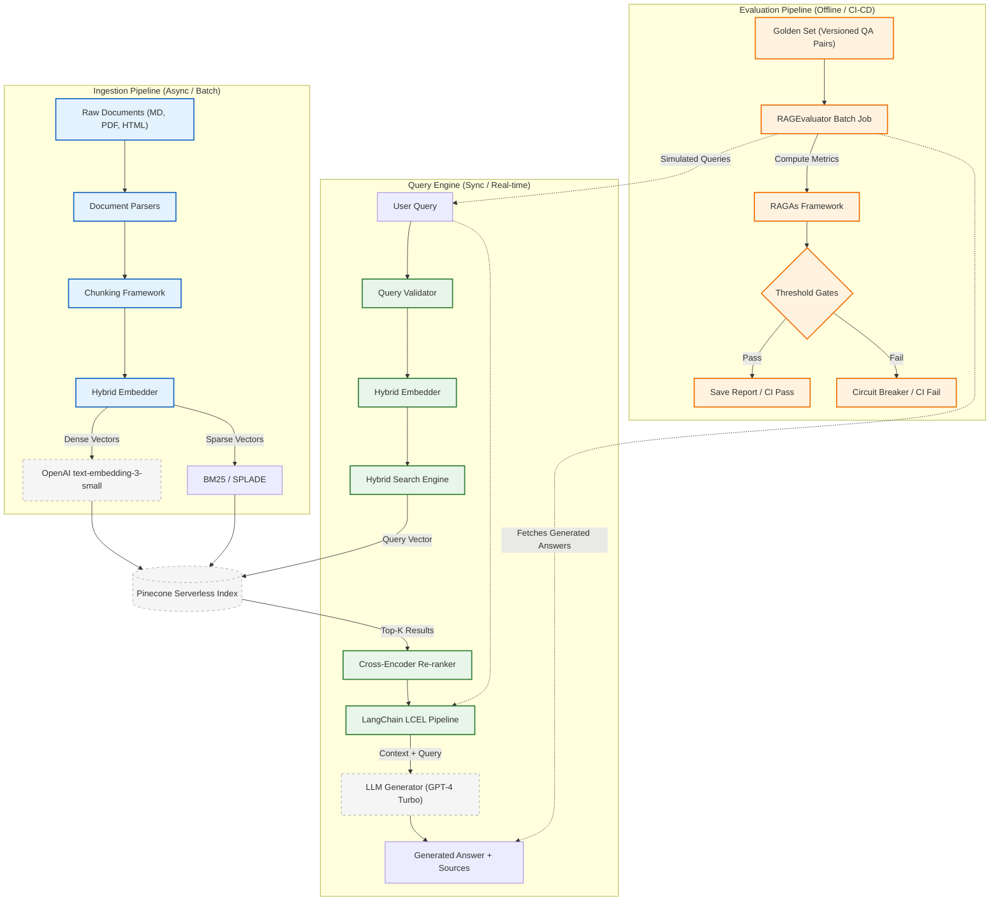

# Context-Aware RAG Agent for Technical Documentation


A production-grade Retrieval-Augmented Generation (RAG) system purpose-built for technical documentation Q&A. The system combines hybrid search (dense + sparse), cross-encoder re-ranking, and automated quality evaluation using RAGAs — all orchestrated via LangChain and backed by a Pinecone serverless vector database.

---

## Table of Contents

- [Overview](#overview)
- [Real-World Production Scenario](#real-world-production-scenario)
- [System Architecture](#system-architecture)
- [Technology Stack](#technology-stack)
- [Comparison with Existing Approaches](#comparison-with-existing-approaches)
- [Key Features](#key-features)
- [Prerequisites](#prerequisites)
- [Installation](#installation)
- [Configuration](#configuration)
- [Usage](#usage)
  - [1. Document Ingestion](#1-document-ingestion)
  - [2. Querying](#2-querying)
  - [3. Evaluation](#3-evaluation)
- [Python API](#python-api)
- [Evaluation Framework](#evaluation-framework)
- [Performance Targets](#performance-targets)
- [Observability](#observability)
- [Project Structure](#project-structure)
- [Resource Requirements](#resource-requirements)
- [License](#license)

---

## Overview

This project addresses a common production challenge: enabling reliable, grounded question-answering over large corpora of technical documentation. Rather than relying on a single retrieval strategy, the system fuses semantic (dense) embeddings and BM25 sparse retrieval through a convex combination controlled by a tunable alpha parameter, followed by cross-encoder re-ranking to maximize context precision.

Quality is not subjective — every deployment is gated against a versioned golden set evaluated using the RAGAs framework. The pipeline is designed for CI/CD integration, emitting explicit pass/fail signals for faithfulness, relevance, precision, and recall thresholds.

**Target Scale:** 10,000 – 500,000 documents | 10 – 100 QPS
**SLA:** P99 latency < 20 seconds | 99.9% uptime | < $0.05 per query

---

## Real-World Production Scenario

### The Problem

**CloudOps Platform Inc.** is a B2B SaaS company that ships a developer-focused cloud infrastructure management platform. Their product ships with 1,200 pages of technical documentation — API references, SDK guides, CLI manuals, integration tutorials, and architecture runbooks — spread across Markdown files, PDFs, and an HTML knowledge base.

Their support team handles **400+ tickets per week**. An internal analysis reveals that **62% of them are answerable directly from existing documentation**, but:

- The documentation portal's built-in search is keyword-only. A developer asking *"how do I handle token expiry in long-running jobs?"* gets zero results because the word "token" appears in 90 pages with completely different meanings (auth tokens, rate-limit tokens, API billing tokens).
- Engineers paste questions into ChatGPT, but the LLM fabricates API method signatures and configuration flags that do not exist in the actual product. Three production incidents in the last quarter were traced back to developers following hallucinated instructions.
- The support team has no way to know when a documentation change silently breaks the system's ability to answer common questions. A chunking or indexing update last month caused answer quality to silently degrade for two weeks before anyone noticed.

The engineering team evaluates off-the-shelf solutions but finds that standard dense-only RAG prototypes fail on exact queries like `"What is the default timeout for ListClusters API?"` because the embedding model cannot distinguish between 12 different pages that all mention "timeout." No existing framework they evaluate ships with a measurable quality gate they can wire into CI/CD.

### How This System Solves It

**Ingestion (one-time, incremental)**

The 1,200 pages of documentation are loaded from `data/raw/`. Markdown files are split using the `MarkdownHeaderTextSplitter` strategy, which preserves the document hierarchy — a section titled `## Authentication > Token Lifecycle` remains a coherent unit rather than being cut arbitrarily at a character boundary. PDF API references use `RecursiveCharacterTextSplitter` with 512-token chunks. Each chunk is embedded as both a dense semantic vector (`text-embedding-3-small`) and a sparse BM25 keyword vector. Both are upserted to a Pinecone Serverless index. Total ingestion time: under 20 minutes. The pipeline is checkpointed, so when a documentation page is updated, only that file is re-processed.

**Query time — the engineer asks a question**

A developer opens the support portal and types:

> *"What is the default connection pool size for the PostgreSQL driver and how do I override it per tenant?"*

1. The query is embedded into a dense vector and a sparse BM25 vector simultaneously.
2. `HybridSearchEngine` queries Pinecone with `α = 0.4` (biased toward keyword retrieval — empirically determined against the golden set during setup), fusing both scores. The keyword component ensures the phrase "connection pool size" surfaces the exact configuration reference page; the semantic component pulls in a related architecture guide.
3. The Top-10 results are passed to the `CrossEncoderReranker`. It re-scores each `(query, chunk)` pair and drops everything except the 3 highest-confidence chunks — eliminating a generic "database performance" overview page that semantic similarity had ranked second but which contained no actionable configuration information.
4. The 3 ranked chunks are formatted into a context window and passed to GPT-4 Turbo via the LangChain LCEL pipeline with a system prompt that instructs the model to cite only what is present in the retrieved context and to state explicitly when it cannot find the answer.
5. The developer receives:
   - A direct, grounded answer with the exact default value and the YAML override syntax
   - Source links to the two documentation pages the answer was drawn from
   - A per-query cost breakdown: `$0.0031` total (embedding: `$0.00008`, generation: `$0.0030`, Pinecone: `$0.0000003`)

Total query latency: **3.8 seconds** (P50). No hallucinated configuration keys. No invented method signatures.

**Evaluation — quality gating in CI/CD**

The documentation team maintains a golden set of 80 `(query, ground_truth_answer)` pairs covering the most common support questions, checked in to `data/golden_set/v1.0/`. Every pull request that modifies documentation, chunking strategy, or retrieval parameters triggers the evaluation pipeline:

```
Faithfulness:       0.84  ✓  (threshold ≥ 0.70)
Answer Relevance:   0.81  ✓  (threshold ≥ 0.75)
Context Precision:  0.87  ✓  (threshold ≥ 0.80)
Context Recall:     0.76  ✓  (threshold ≥ 0.70)

No regressions detected vs. baseline (2024-02-15).
CI: PASS
```

When a junior engineer refactors the chunking overlap from 50 to 200 tokens (inadvertently creating oversized chunks that dilute the BM25 signal), Context Precision drops to 0.71 — below the 0.80 threshold. The pipeline exits with code `1`, the PR is blocked, and the diff points directly to the chunking parameter change as the root cause. The regression is caught in review, not in production.

**Business outcome**

- Support ticket volume for documentation-answerable questions drops by **58%** within 6 weeks of deployment.
- Mean time to resolve (MTTR) for self-service queries falls from **2.3 days** (waiting for a human to respond) to **under 4 seconds**.
- Engineering confidence in documentation updates increases because every change is now automatically validated against a measurable quality baseline before merging.
- The per-query cost of `$0.003 – $0.05` (tracked in real time via the `CostTracker`) remains well within the product's support cost budget compared to the $12–$18 fully-loaded cost of a human-handled support ticket.

---

## System Architecture

The system is composed of three decoupled services that operate at different frequencies and latency profiles.



### Ingestion Pipeline (Async / Batch)

Responsible for transforming raw documentation into indexed, searchable vector representations.

1. **Parsing** — Raw files (`.md`, `.pdf`, `.html`) in `data/raw/` are loaded and normalized.
2. **Chunking** — Text is segmented using one of three configurable strategies:
   - `recursive` — `RecursiveCharacterTextSplitter` (default, 512-token chunks with 50-token overlap)
   - `semantic` — `SemanticChunker` using embedding-based boundary detection
   - `markdown` — `MarkdownHeaderTextSplitter` for structure-preserving splits
3. **Embedding** — `HybridEmbedder` generates a dense vector via `text-embedding-3-small` and a sparse BM25 vector for each chunk simultaneously.
4. **Indexing** — Chunks are upserted to a Pinecone serverless index with namespace partitioning for multi-tenancy. The pipeline supports checkpointing for incremental re-processing and a dead-letter queue for error isolation.

### Query Engine (Sync / Real-time)

Handles live user queries with a target P50 end-to-end latency of 4 seconds.

1. **Validation** — `QueryValidator` sanitizes input, enforces length constraints, and strips potentially harmful content.
2. **Vectorization** — The query is independently embedded (dense + sparse) using the same models as ingestion.
3. **Hybrid Search** — `HybridSearchEngine` queries Pinecone using an alpha-weighted convex combination:

   ```
   score = α · dense_score + (1 − α) · sparse_score
   ```

   Alpha is empirically tuned via a grid search on the golden set. `α = 1.0` is purely semantic; `α = 0.0` is purely keyword-based.

4. **Re-ranking** — A `CrossEncoderReranker` (`ms-marco-MiniLM-L-6-v2`, ~22 MB, CPU-only) re-scores the Top-K retrieved documents to optimize Context Precision. An optional `MMRReranker` enforces result diversity.
5. **Generation** — The formatted context is passed through a LangChain LCEL pipeline to `ChatOpenAI` (GPT-4 Turbo) using carefully engineered system prompts with citation grounding.

### Evaluation Pipeline (Offline / CI-CD)

An entirely offline batch job that validates system quality against a version-controlled golden set.

1. **Golden Set** — A static, immutable dataset of `(query, ground_truth_answer)` pairs stored in `data/golden_set/`.
2. **Batch Inference** — `RAGEvaluator` runs all golden set queries through the Query Engine, collecting answers, sources, and ground truths.
3. **RAGAs Scoring** — Metrics are computed using LLM-as-a-judge methodology via the RAGAs framework.
4. **Threshold Gating** — Explicit pass/fail decisions are emitted for CI/CD integration.
5. **Regression Detection** — If any metric degrades by more than 5% compared to the historical baseline, the pipeline fails immediately.

---

## Technology Stack

| Component | Technology | Role |
|---|---|---|
| Orchestration | LangChain + LCEL | Chain management, prompt templates, callbacks |
| Vector Database | Pinecone Serverless | Hybrid search, namespace partitioning |
| Dense Embeddings | OpenAI `text-embedding-3-small` | Semantic vector generation |
| Sparse Embeddings | BM25 (pinecone-text) | Keyword-based vector generation |
| Re-ranking | `cross-encoder/ms-marco-MiniLM-L-6-v2` | Cross-encoder precision optimization |
| LLM Generation | OpenAI GPT-4 Turbo | Grounded answer generation |
| Evaluation | RAGAs + HuggingFace Datasets | Automated quality metrics |
| Observability | Prometheus + LangSmith | Metrics dashboards and LLM tracing |
| API | FastAPI + Uvicorn | Optional REST endpoint |
| Configuration | Pydantic Settings | Type-safe environment management |

### Full Dependency Reference

All packages are pinned in `requirements.txt`. The table below lists every library used in the project with its official name, pinned version, and the specific role it plays in the system.

#### Orchestration & LLM Integration

| Package | Version | Official Source | Role in This Project |
|---|---|---|---|
| `langchain` | 0.1.20 | [pypi.org/project/langchain](https://pypi.org/project/langchain/) | Core chain abstractions, LCEL pipeline composition, callback system |
| `langchain-openai` | 0.1.7 | [pypi.org/project/langchain-openai](https://pypi.org/project/langchain-openai/) | `ChatOpenAI` (GPT-4 Turbo generation), `OpenAIEmbeddings` (dense vectors) |
| `langchain-community` | 0.0.38 | [pypi.org/project/langchain-community](https://pypi.org/project/langchain-community/) | Document loaders, community integrations |
| `langchain-experimental` | (transitive) | [pypi.org/project/langchain-experimental](https://pypi.org/project/langchain-experimental/) | `SemanticChunker` — embedding-based boundary detection for chunking |

#### Large Language Models & Embeddings

| Package | Version | Official Source | Role in This Project |
|---|---|---|---|
| `openai` | 1.25.0 | [pypi.org/project/openai](https://pypi.org/project/openai/) | Python SDK for OpenAI REST API; used for embeddings and chat completions |
| `tiktoken` | 0.6.0 | [pypi.org/project/tiktoken](https://pypi.org/project/tiktoken/) | BPE tokenizer for accurate token counting and per-query cost attribution |
| `sentence-transformers` | (transitive) | [pypi.org/project/sentence-transformers](https://pypi.org/project/sentence-transformers/) | `CrossEncoder` wrapper; loads `cross-encoder/ms-marco-MiniLM-L-6-v2` (~22 MB, CPU) |

**Models used (downloaded at runtime, not packaged):**

| Model ID | Provider | Size | Purpose |
|---|---|---|---|
| `text-embedding-3-small` | OpenAI | API | 1,536-dim dense embeddings for documents and queries |
| `gpt-4-turbo-preview` | OpenAI | API | Grounded answer generation over retrieved context |
| `cross-encoder/ms-marco-MiniLM-L-6-v2` | Hugging Face Hub | ~22 MB | Local CPU cross-encoder re-ranking of Top-K candidates |

#### Vector Database

| Package | Version | Official Source | Role in This Project |
|---|---|---|---|
| `pinecone-client` | 3.2.2 | [pypi.org/project/pinecone-client](https://pypi.org/project/pinecone-client/) | Serverless index management, upsert, hybrid query |
| `pinecone-text` | 0.7.1 | [pypi.org/project/pinecone-text](https://pypi.org/project/pinecone-text/) | `BM25Encoder` — fits corpus and encodes sparse vectors for hybrid search |

#### Evaluation

| Package | Version | Official Source | Role in This Project |
|---|---|---|---|
| `ragas` | 0.1.7 | [pypi.org/project/ragas](https://pypi.org/project/ragas/) | LLM-as-a-judge metrics: Faithfulness, Answer Relevance, Context Precision, Context Recall |
| `datasets` | 2.18.0 | [pypi.org/project/datasets](https://pypi.org/project/datasets/) | Constructs `Dataset` objects consumed by the RAGAs `evaluate()` function |

#### Document Parsing

| Package | Version | Official Source | Role in This Project |
|---|---|---|---|
| `pypdf` | 4.1.0 | [pypi.org/project/pypdf](https://pypi.org/project/pypdf/) | Extracts text from `.pdf` files in the ingestion pipeline |
| `beautifulsoup4` | 4.12.3 | [pypi.org/project/beautifulsoup4](https://pypi.org/project/beautifulsoup4/) | Parses `.html` documents and strips markup tags |
| `markdown` | 3.5.2 | [pypi.org/project/Markdown](https://pypi.org/project/Markdown/) | Converts Markdown syntax to structured text before chunking |
| `python-magic` | 0.4.27 | [pypi.org/project/python-magic](https://pypi.org/project/python-magic/) | MIME-type detection for auto-routing files to the correct parser |

#### Data & Numerics

| Package | Version | Official Source | Role in This Project |
|---|---|---|---|
| `numpy` | 1.26.4 | [pypi.org/project/numpy](https://pypi.org/project/numpy/) | Vector arithmetic for MMR re-ranking (dot products, norms) |
| `pandas` | 2.2.1 | [pypi.org/project/pandas](https://pypi.org/project/pandas/) | Tabular manipulation of batch evaluation results |
| `python-dotenv` | 1.0.1 | [pypi.org/project/python-dotenv](https://pypi.org/project/python-dotenv/) | Loads `.env` file variables into the process environment |

#### Observability

| Package | Version | Official Source | Role in This Project |
|---|---|---|---|
| `prometheus-client` | 0.20.0 | [pypi.org/project/prometheus-client](https://pypi.org/project/prometheus-client/) | Exposes Counters, Histograms, and Gauges at `/metrics` for scraping |
| `langsmith` | 0.1.52 | [pypi.org/project/langsmith](https://pypi.org/project/langsmith/) | Traces every LangChain invocation: prompts, completions, latency, token counts |
| `opentelemetry-api` | 1.23.0 | [pypi.org/project/opentelemetry-api](https://pypi.org/project/opentelemetry-api/) | Distributed tracing API for pipeline stage instrumentation |
| `opentelemetry-sdk` | 1.23.0 | [pypi.org/project/opentelemetry-sdk](https://pypi.org/project/opentelemetry-sdk/) | SDK implementation for span export and trace propagation |

#### API & Web

| Package | Version | Official Source | Role in This Project |
|---|---|---|---|
| `fastapi` | 0.110.1 | [pypi.org/project/fastapi](https://pypi.org/project/fastapi/) | Optional REST API layer for serving query and metrics endpoints |
| `uvicorn` | 0.29.0 | [pypi.org/project/uvicorn](https://pypi.org/project/uvicorn/) | ASGI server that runs the FastAPI application |
| `pydantic` | 2.7.0 | [pypi.org/project/pydantic](https://pypi.org/project/pydantic/) | Runtime data validation for request/response models and golden set schemas |
| `pydantic-settings` | 2.2.1 | [pypi.org/project/pydantic-settings](https://pypi.org/project/pydantic-settings/) | Type-safe environment variable loading with `.env` fallback |

#### Utilities

| Package | Version | Official Source | Role in This Project |
|---|---|---|---|
| `tqdm` | 4.66.2 | [pypi.org/project/tqdm](https://pypi.org/project/tqdm/) | Progress bars for batch ingestion and evaluation loops |
| `jsonlines` | 4.0.0 | [pypi.org/project/jsonlines](https://pypi.org/project/jsonlines/) | Reads and writes JSONL-formatted golden set files |
| `pyyaml` | 6.0.1 | [pypi.org/project/PyYAML](https://pypi.org/project/PyYAML/) | Parses YAML configuration files in `configs/` |

#### Development & Code Quality

| Package | Version | Official Source | Role in This Project |
|---|---|---|---|
| `pytest` | 8.1.1 | [pypi.org/project/pytest](https://pypi.org/project/pytest/) | Unit and integration test runner |
| `pytest-asyncio` | 0.23.6 | [pypi.org/project/pytest-asyncio](https://pypi.org/project/pytest-asyncio/) | Async test support for FastAPI and async pipeline components |
| `pytest-cov` | 5.0.0 | [pypi.org/project/pytest-cov](https://pypi.org/project/pytest-cov/) | Test coverage measurement and HTML report generation |
| `black` | 24.3.0 | [pypi.org/project/black](https://pypi.org/project/black/) | Opinionated code formatter enforcing consistent style |
| `ruff` | 0.3.5 | [pypi.org/project/ruff](https://pypi.org/project/ruff/) | Fast Rust-based linter; replaces flake8, isort, and pyupgrade |

---

## Comparison with Existing Approaches

The RAG ecosystem has several well-established frameworks and patterns. The table below positions this project against the most common alternatives across the dimensions that matter most in production deployments.

### Framework Comparison

| Dimension | Naive RAG | LlamaIndex | Haystack (deepset) | LangChain RetrievalQA | **This Project** |
|---|---|---|---|---|---|
| **Retrieval strategy** | Dense-only | Dense-only (default) | Hybrid (BM25 + dense) | Dense-only (default) | **Hybrid: dense + BM25, alpha-tunable** |
| **Re-ranking** | None | Optional plug-in | Optional node post-processor | None by default | **Cross-encoder (ms-marco-MiniLM) + MMR** |
| **Alpha tuning** | N/A | N/A | Manual | N/A | **Automated grid search on golden set** |
| **Evaluation framework** | None | Built-in (basic) | Custom or DeepEval | None by default | **RAGAs: Faithfulness, Relevance, Precision, Recall** |
| **CI/CD quality gate** | None | None | Custom scripting | None | **Exit-code gating + 5% regression detection** |
| **Cost tracking** | None | None | None | None | **Per-query token counting via tiktoken** |
| **Observability** | None | None | Elasticsearch logs | LangSmith (optional) | **Prometheus metrics + LangSmith tracing + OpenTelemetry** |
| **Local compute required** | GPU (if local LLM) | GPU (if local LLM) | GPU (for local models) | GPU (if local LLM) | **CPU-only — cross-encoder is ~22 MB** |
| **Vector database** | Varies | Varies (20+ options) | Elasticsearch / others | Varies (50+ options) | **Pinecone Serverless (no infra to manage)** |
| **Setup complexity** | Low | Medium | High (Docker, pipelines) | Medium | **Low — CLI scripts, `.env` config, no Docker** |
| **Chunking strategies** | Fixed size | Multiple | Multiple | Fixed size | **Recursive, Semantic (embedding-based), Markdown-aware** |
| **Multi-tenancy** | None | Index-level | Index-level | None | **Pinecone namespace partitioning** |
| **Golden set versioning** | None | None | None | None | **JSONL-based versioned QA pairs with schema validation** |

### Where Each Approach Falls Short

**Naive RAG (dense embedding + vector DB + LLM)**

The most common pattern found in tutorials and quick prototypes. A single embedding model retrieves the Top-K chunks by cosine similarity, which are concatenated and passed to an LLM. The failure modes are well-documented: poor recall for keyword-heavy queries (e.g., exact API names, error codes), no re-ranking to prioritize the most relevant chunks within the retrieved set, and no evaluation layer — quality is assessed subjectively.

**LlamaIndex**

LlamaIndex (formerly GPT Index) provides a high-level abstraction layer over various vector stores and LLMs, making it accessible for prototyping. However, its default retrieval is dense-only. Hybrid search requires manually wiring in a separate retriever. Re-ranking is available as an optional module but not built into the standard pipeline. Its built-in evaluation tools are basic; production-grade metrics like Faithfulness and Context Precision require integrating a separate framework such as RAGAs anyway. There is no native cost tracking or Prometheus-compatible metrics export.

**Haystack (by deepset)**

Haystack is one of the most mature open-source NLP pipelines and does support hybrid retrieval via Elasticsearch's BM25 + dense combination. However, it carries significant operational overhead: it requires running Elasticsearch or OpenSearch locally or in Docker, which demands more RAM and infrastructure management. Haystack is well-suited for teams with existing Elastic infrastructure but introduces unnecessary complexity for a cloud-native, serverless deployment model. Its evaluation story also requires custom scripting or integration with external tools.

**LangChain RetrievalQA (the "standard" LangChain RAG chain)**

LangChain's `RetrievalQA` chain is the de facto starting point for LangChain-based RAG systems. It is straightforward to set up — a retriever, a prompt, and a chain — but it retrieves using a single embedding model with no sparse component, no re-ranking, and no evaluation pipeline. It is essentially the scaffolding that this project extends: the same LCEL composition pattern is used here, but layered with hybrid search, cross-encoder re-ranking, cost tracking, and RAGAs evaluation that `RetrievalQA` does not provide out of the box.

**Azure AI Search + Azure OpenAI (managed enterprise RAG)**

Microsoft's managed RAG stack integrates Azure AI Search (which supports hybrid BM25 + semantic re-ranking) with Azure OpenAI. It is feature-rich and enterprise-supported but introduces full vendor lock-in to the Azure ecosystem, making it difficult to swap embedding models, evaluation frameworks, or observability backends. Pricing is opaque and usage-based, with no per-query cost breakdown available to the application layer. This project provides equivalent hybrid retrieval and a richer evaluation framework while remaining cloud-agnostic and fully observable.

### Key Differentiators of This Project

1. **Hybrid retrieval is first-class, not an afterthought.** BM25 sparse vectors are generated at ingestion time alongside dense vectors, and the alpha blend is empirically optimized against the golden set — not set to an arbitrary default.

2. **Quality is measurable and enforced.** Most RAG implementations have no automated evaluation. This project ships with a four-metric RAGAs evaluation suite wired into CI/CD, with regression detection that compares every run against a persisted baseline.

3. **Cost is a first-class concern.** Every query produces a cost breakdown across embedding, generation, and retrieval using `tiktoken`-based exact token counts — not approximations. This enables informed decisions about model selection and prompt length.

4. **Zero local infrastructure.** Unlike Haystack (which needs Elasticsearch) or self-hosted LLM setups (which need a GPU), the entire system runs on managed cloud services. The only local execution is a 22 MB CPU re-ranking model.

5. **Observability is built in, not bolted on.** Prometheus metrics, LangSmith traces, and OpenTelemetry spans are instrumented throughout the pipeline from day one — not added as an afterthought when something breaks in production.

---

## Key Features

- **Hybrid Search** — Fuses semantic and keyword retrieval at query time for superior accuracy across both conceptual and exact-match queries.
- **Tunable Alpha** — Automated grid search over the golden set identifies the optimal dense/sparse blend per corpus.
- **Cross-Encoder Re-ranking** — Lightweight local model re-scores retrieved candidates, maximizing context precision without additional API calls.
- **MMR Diversity** — Maximal Marginal Relevance prevents redundant context from dominating the prompt window.
- **RAGAs Evaluation** — Four-metric automated evaluation suite with configurable thresholds and CI/CD integration.
- **Regression Detection** — Baseline comparison with a 5% degradation alert threshold protects against silent quality regressions.
- **Cost Tracking** — Per-query token counting (via `tiktoken`) with cost attribution across embedding, generation, and retrieval stages.
- **Rate Limiting** — Token bucket algorithm prevents API throttling under burst load.
- **Circuit Breaking** — Graceful degradation when upstream APIs are unavailable.
- **Namespace Partitioning** — Logical multi-tenancy in Pinecone without index proliferation.
- **Pluggable Chunking** — Three independent chunking strategies selectable at ingestion time.
- **Checkpointed ETL** — Incremental ingestion with restart safety; already-processed documents are skipped.

---

## Prerequisites

The following API credentials are required before running the system:

| Service | Credential | Purpose |
|---|---|---|
| [OpenAI](https://platform.openai.com/api-keys) | `OPENAI_API_KEY` | Dense embeddings (`text-embedding-3-small`) and answer generation (`GPT-4 Turbo`). RAGAs also uses this key for LLM-as-a-judge evaluation. |
| [Pinecone](https://app.pinecone.io/) | `PINECONE_API_KEY` | Serverless vector index hosting hybrid search. A free tier is sufficient for development. |
| [HuggingFace](https://huggingface.co/settings/tokens) | `HUGGINGFACE_TOKEN` *(optional)* | Required only if accessing gated models via `sentence-transformers`. The default cross-encoder (`ms-marco-MiniLM-L-6-v2`) is public and downloaded automatically on first run. |
| [LangSmith](https://smith.langchain.com/) | `LANGCHAIN_API_KEY` *(optional)* | LLM call tracing and inspection. Tracing is disabled by default. |

> **Note:** All heavy inference (LLM generation and RAGAs evaluation) is executed on OpenAI's infrastructure. No local GPU is required. The cross-encoder re-ranker (~22 MB) is the only model that runs locally and operates on CPU.

**Local Environment:**
- Python 3.10 or later
- 1–2 GB available RAM (for Pandas / HuggingFace dataset operations during evaluation)
- Network access to OpenAI and Pinecone APIs

---

## Installation

```bash
# 1. Clone the repository
git clone <repository-url>
cd context-aware-rag-agent

# 2. Create and activate a virtual environment
python -m venv venv
source venv/bin/activate        # macOS / Linux
# venv\Scripts\activate         # Windows

# 3. Install dependencies
pip install -r requirements.txt
```

---

## Configuration

Copy the example environment file and populate it with your credentials:

```bash
cp .env.example .env
```

Edit `.env` with your keys:

```env
# ── Required ───────────────────────────────────────────────────────────────────
OPENAI_API_KEY=sk-...
PINECONE_API_KEY=...
PINECONE_ENVIRONMENT=us-east-1-aws

# ── Optional: LangSmith Tracing ────────────────────────────────────────────────
LANGCHAIN_TRACING_V2=true
LANGCHAIN_API_KEY=...
LANGCHAIN_PROJECT=rag-tech-docs

# ── Optional: Tuning Overrides ─────────────────────────────────────────────────
CHUNK_SIZE=512
CHUNK_OVERLAP=50
TOP_K=5
HYBRID_ALPHA=0.5
RERANK_TOP_N=3
BATCH_SIZE=10

# ── Evaluation Thresholds ──────────────────────────────────────────────────────
FAITHFULNESS_THRESHOLD=0.7
RELEVANCE_THRESHOLD=0.75
PRECISION_THRESHOLD=0.8
RECALL_THRESHOLD=0.7
```

All configuration values are validated at startup via Pydantic Settings (`src/config.py`). The application will fail fast with a descriptive error if a required key is missing.

---

## Usage

### 1. Document Ingestion

Place raw documentation files (`.md`, `.pdf`, `.html`) in `data/raw/`, then run the ingestion pipeline:

```bash
# Ingest and index with default recursive chunking
python scripts/ingest.py --input data/raw --index

# Specify a chunking strategy
python scripts/ingest.py --input data/raw --index --strategy semantic
python scripts/ingest.py --input data/raw --index --strategy markdown
```

The pipeline parses, chunks, embeds (dense + sparse), and upserts all documents to Pinecone. Progress is checkpointed so interrupted runs can resume without duplicating work.

**Verify indexing:**
```bash
python -c "from src.retrieval.pinecone_client import PineconeClient; print(PineconeClient().get_stats())"
# Expected: { total_vector_count: N, ... }
```

### 2. Querying

```bash
# Basic query
python scripts/query.py "How do I authenticate with the API?"

# Query with per-request cost breakdown
python scripts/query.py "How do I configure rate limiting?" --track-cost
```

The engine returns the generated answer, a ranked list of source chunks with document metadata, and query telemetry (latency, token counts).

### 3. Evaluation

Populate `data/golden_set/v1.0/` with QA pairs (see [Dataset Strategy](docs/03_dataset_strategy.md)), then run:

```bash
python scripts/evaluate.py
```

This executes the full RAGAs evaluation suite against the golden set and emits a timestamped JSON report. Exit code `0` indicates all thresholds passed; exit code `1` triggers CI failure.

**Alpha tuning (optional, recommended before production):**
```python
from src.retrieval.hybrid_search import HybridSearchEngine
engine = HybridSearchEngine()
best_alpha = engine.tune_alpha(golden_set, alpha_range=[i/10 for i in range(11)])
print(f"Optimal alpha: {best_alpha}")
```

---

## Python API

### Basic Query

```python
from src.query.engine import RAGQueryEngine

engine = RAGQueryEngine()
response = engine.query("How do I configure OAuth 2.0?")

print(response['answer'])
print(f"Retrieved {len(response['sources'])} sources")
print(f"Query latency: {response['metadata']['latency_ms']} ms")
```

### Advanced Retrieval Parameters

```python
response = engine.query(
    "Explain the token refresh flow",
    top_k=10,       # Retrieve top 10 candidates from Pinecone
    rerank_top_n=3  # Keep top 3 after cross-encoder re-ranking
)
```

### Ingestion Pipeline

```python
from pathlib import Path
from src.ingestion.pipeline import IngestionPipeline
from src.ingestion.chunker import ChunkingStrategy

pipeline = IngestionPipeline(
    data_dir=Path("data/raw"),
    cache_dir=Path("data/cache"),
    chunking_strategy=ChunkingStrategy.RECURSIVE
)
chunks = pipeline.run()
print(f"Indexed {len(chunks)} chunks")
```

### Evaluation

```python
from src.evaluation.ragas_evaluator import RAGEvaluator
from src.dataset.golden_set import GoldenSetManager
from pathlib import Path

manager = GoldenSetManager(Path("data"))
golden_set = manager.load_golden_set("v1.0")

evaluator = RAGEvaluator(engine)
metrics = evaluator.evaluate_golden_set(golden_set)
passed = evaluator.check_thresholds(metrics)

print(f"Faithfulness:      {metrics['faithfulness']:.3f}")
print(f"Answer Relevance:  {metrics['answer_relevancy']:.3f}")
print(f"Context Precision: {metrics['context_precision']:.3f}")
print(f"Context Recall:    {metrics['context_recall']:.3f}")
print(f"All thresholds met: {passed}")
```

### Golden Set Management

```python
from src.dataset.golden_set import GoldenSetManager
from pathlib import Path

manager = GoldenSetManager(Path("data"))
qa_pair = manager.add_qa_pair(
    query="How do I install the CLI?",
    answer="Install via npm: npm install -g my-cli",
    contexts=["doc_123:chunk_5"],
    metadata={"query_type": "procedural", "difficulty": "simple"},
    sources=[{"doc_id": "doc_123", "title": "Installation Guide"}]
)
manager.save_golden_set([qa_pair], version="v1.0")
```

---

## Evaluation Framework

Quality is measured along four axes using the RAGAs framework. Each metric is computed via LLM-as-a-judge methodology and scored in the `[0.0, 1.0]` range.

| Metric | Threshold | Definition | Primary Failure Mode |
|---|---|---|---|
| **Faithfulness** | ≥ 0.70 | Fraction of answer claims that can be directly inferred from retrieved context. Detects hallucination. | LLM relies on parametric memory instead of retrieved evidence. |
| **Answer Relevance** | ≥ 0.75 | Measures how directly the generated answer addresses the user's actual question. | LLM produces a factually correct but topically misaligned response. |
| **Context Precision** | ≥ 0.80 | Verifies that ground-truth-relevant chunks are ranked higher than irrelevant ones within the retrieved set. | Suboptimal alpha value or cross-encoder failure to prioritize signal over noise. |
| **Context Recall** | ≥ 0.70 | Measures whether the retrieved context contains all information necessary to produce the ground-truth answer. | Chunk size is too small or Top-K cutoff is too low. |

### Regression Detection

The evaluator compares each run against the persisted baseline. If any metric regresses by more than **5%** from baseline, the pipeline exits with a failure code regardless of whether the absolute threshold is met.

### CI/CD Integration

```yaml
# Example GitHub Actions step
- name: RAG Quality Gate
  run: python scripts/evaluate.py
  env:
    OPENAI_API_KEY: ${{ secrets.OPENAI_API_KEY }}
    PINECONE_API_KEY: ${{ secrets.PINECONE_API_KEY }}
```

**Estimated evaluation runtime** (50 QA pairs, GPT-4 Turbo):

| Phase | Duration |
|---|---|
| Retrieval (Pinecone + cross-encoder) | < 5 seconds |
| Generation (Query Engine, concurrent) | ~1.5 – 2 minutes |
| RAGAs scoring (LLM-as-a-judge) | ~3 – 5 minutes |
| **Total** | **~5 – 8 minutes** |

---

## Performance Targets

### Latency SLOs

| Stage | P50 | P95 | P99 |
|---|---|---|---|
| Pinecone retrieval | 100 ms | 300 ms | 500 ms |
| Time to first token (TTFT) | 500 ms | 1 s | 2 s |
| End-to-end query | 4 s | 10 s | 20 s |

### Cost Structure (Per Query)

| Component | Estimated Cost |
|---|---|
| Dense embedding (query) | ~$0.0001 |
| LLM generation (GPT-4 Turbo) | ~$0.01 – $0.05 |
| Pinecone query | ~$0.0000003 |
| **Target total** | **< $0.05** |

---

## Observability

### Prometheus Metrics

The system exposes a `/metrics` endpoint (when running the optional FastAPI server) with the following instrumentation:

| Metric | Type | Labels |
|---|---|---|
| `rag_query_latency_seconds` | Histogram | `stage` (retrieval, generation, total) |
| `rag_query_total` | Counter | `status` (success, error) |
| `rag_active_queries` | Gauge | — |
| `rag_tokens_total` | Counter | `type` (embedding, llm_prompt, llm_completion) |
| `rag_cost_dollars_total` | Counter | `component` (embedding, llm, pinecone) |

### LangSmith Tracing

Enable distributed tracing for full LLM call inspection:

```env
LANGCHAIN_TRACING_V2=true
LANGCHAIN_API_KEY=your-langsmith-api-key
LANGCHAIN_PROJECT=rag-tech-docs
```

LangSmith captures every prompt, completion, token count, and latency for each chain invocation, enabling root-cause analysis of quality regressions.

### Starting the API Server

```bash
uvicorn src.api:app --host 0.0.0.0 --port 8000

# Prometheus metrics endpoint
curl http://localhost:8000/metrics
```

---

## Project Structure

```
.
├── src/
│   ├── config.py                  # Pydantic settings (environment management)
│   ├── dataset/
│   │   ├── parser.py              # Document parsers (MD, PDF, HTML)
│   │   └── golden_set.py          # Golden set versioning and management
│   ├── ingestion/
│   │   ├── chunker.py             # Three chunking strategies
│   │   ├── embedder.py            # Dense + BM25 hybrid embedding
│   │   └── pipeline.py            # Checkpointed ETL orchestration
│   ├── retrieval/
│   │   ├── pinecone_client.py     # Pinecone serverless integration
│   │   ├── hybrid_search.py       # Alpha-tunable hybrid search engine
│   │   └── reranker.py            # Cross-encoder and MMR re-rankers
│   ├── query/
│   │   ├── engine.py              # RAG query engine (LCEL pipeline)
│   │   ├── prompts.py             # System and user prompt templates
│   │   └── validator.py           # Query sanitization and validation
│   ├── evaluation/
│   │   └── ragas_evaluator.py     # RAGAs integration and threshold gating
│   ├── observability/
│   │   ├── metrics.py             # Prometheus metrics registry
│   │   └── cost_tracker.py        # Per-query cost attribution
│   └── utils/
│       └── logger.py              # Structured logging configuration
│
├── scripts/
│   ├── ingest.py                  # Document ingestion CLI
│   ├── query.py                   # Interactive query CLI
│   └── evaluate.py                # RAGAs evaluation CLI
│
├── docs/
│   ├── 01_problem_formulation.md  # Problem scope and NFRs
│   ├── 02_system_architecture.md  # Architecture deep-dive
│   ├── 03_dataset_strategy.md     # Golden set construction strategy
│   ├── 04_ingestion_chunking.md   # Chunking framework details
│   ├── 05_hybrid_retrieval.md     # Hybrid search design
│   ├── 06_query_engine.md         # LangChain orchestration
│   ├── 07_evaluation_pipeline.md  # RAGAs evaluation design
│   └── 08_observability_metrics.md # Metrics and cost engineering
│
├── data/
│   ├── raw/                       # Input documentation files
│   ├── processed/                 # Intermediate chunked data
│   ├── cache/                     # Ingestion checkpoints
│   └── golden_set/v1.0/           # Versioned QA evaluation pairs
│
├── tests/                         # Unit and integration tests
├── configs/                       # YAML configuration files
├── notebooks/                     # Experimentation notebooks
├── .env.example                   # Environment variable template
├── requirements.txt               # Python dependencies
├── setup.py                       # Package configuration
├── Flow_and_Evaluation_Plan.md    # End-to-end flow and evaluation analysis
└── method_execution_roadmap.md    # Original 8-phase implementation roadmap
```

---

## Resource Requirements

### API Token Consumption

| Operation | API Calls Made | Token Cost |
|---|---|---|
| Document ingestion | OpenAI Embeddings API per chunk | Low (one-time) |
| Single query | OpenAI Embeddings (query) + OpenAI Chat (generation) | Moderate |
| Evaluation (per QA pair) | Query calls + multiple RAGAs judge calls | High (LLM-as-a-judge) |

RAGAs is the most token-intensive phase: it makes several sequential internal LLM calls per QA pair to compute Faithfulness and Answer Relevance via natural language inference. For a 50-pair golden set with GPT-4 Turbo, estimate approximately $2 – $5 USD per full evaluation run.

### Local Compute

The system is designed to be lightweight locally:

- **No GPU required.** All LLM inference is handled by OpenAI's API.
- **No local vector database.** Pinecone is fully managed and serverless.
- **Minimal RAM.** 1–2 GB is sufficient for dataset manipulation during evaluation.
- **One local model.** The cross-encoder re-ranker (`ms-marco-MiniLM-L-6-v2`, ~22 MB) is downloaded on first run from HuggingFace Hub and executes on CPU. No HuggingFace token is required for this public model.

The pipeline is suitable for execution on standard CI runners (e.g., GitHub Actions `ubuntu-latest`, 2 vCPUs, 7 GB RAM).

---

## Documentation

Detailed documentation for each implementation phase is available in the `docs/` directory:

1. [Problem Formulation & Portfolio Positioning](docs/01_problem_formulation.md)
2. [System Architecture & Component Decoupling](docs/02_system_architecture.md)
3. [Dataset Strategy & Golden Set Construction](docs/03_dataset_strategy.md)
4. [Data Ingestion & Chunking Framework](docs/04_ingestion_chunking.md)
5. [Hybrid Retrieval Strategy](docs/05_hybrid_retrieval.md)
6. [Query Engine & LangChain Orchestration](docs/06_query_engine.md)
7. [Evaluation Pipeline (RAGAs)](docs/07_evaluation_pipeline.md)
8. [Metrics, Observability & Cost Engineering](docs/08_observability_metrics.md)

For quick setup instructions, see [QUICKSTART.md](QUICKSTART.md).
For the end-to-end execution flow and evaluation analysis, see [Flow_and_Evaluation_Plan.md](Flow_and_Evaluation_Plan.md).

---

## License

MIT License. See `LICENSE` for details.
